# Socioeconomics and Writing Styles

<!--    -->

This is the GitHub repository for Vishal Singh, Jeremy Yang and Zhen Yuan's paper Socioeconomics & Writing Styles: An analysis of US Public School Teachers. The draft is still in preparation. If you have any comments or questions, please contact [Zhen Yuan](https://www.yuan-zhen.com/).

<!-- > If you're new to open source, please consider taking the [free "Introduction to Open Source" class](https://cognitiveclass.ai/courses/introduction-to-open-source). -->
> 
<!-- >  -->

<!-- _Read this in other languages: [English](README.md), [한국어](./docs/README.ko.md), [português](./docs/README.pt_br.md)._ -->

## Contents

- [Socioeconomics and Writing Styles](#socioeconomics-and-writing-styles)
  - [Contents](#contents)
  - [Introduction](#introduction)
  - [Data](#data)
    - [SEDA Data](#seda-data)
    - [DonorsChoose Data](#donorschoose-data)
  - [Structured Analysis](#structured-analysis)
  - [Unstructured Analysis](#unstructured-analysis)
    - [CNN Classification](#cnn-classification)
    - [BERT Sentence Classification](#bert-sentence-classification)
  - [Authors](#authors)
  - [Acknowledgments](#acknowledgments)
## Introduction

## Data
### SEDA Data

#### Description
We use data from the Stanford Education Data Archive (SEDA) to measure the educational and economic gaps between rich schools and poor schools across the US. SEDA contains data about test scores for schools, geographically defined school districts, counties, commuting zones, metropolitan statistical areas, and states. The data spans from 3rd to 8th grade and from 2008-09 to 2017-18 school years. Besides, it also provides information of socioeconomic, demographic, and segregation characteristics of schools, districts, counties, metropolitan areas, and states. The school is uniquely identified by the 12-digit NCES school ID (ncessch), which is used to link the DonorsChoose data. 

SEDA includes 82357 Public Elementary/Secondary Schools in the US. The table below reports number of schools in the nine divisions defined by United States Census Bureau.

| Division           | Num of Schools         | High Poverty| Medium-high Poverty | Medium-low Poverty | Low Poverty |
|--------------------|--------------------|-----------------|------------------------|-----------------------|----------------|
| East North Central | 13180              | 2422            | 2743                   | 4837                  | 3178           |
| South Atlantic     | 12492              | 2853            | 3927                   | 3630                  | 2082           |  
| Pacific            | 12109              | 2322            | 3786                   | 3350                  | 2651           |  
| West South Central | 11027              | 2564            | 4037                   | 3081                  | 1345           |
| Middle Atlantic    | 8578               | 1517            | 1517                   | 2542                  | 3002           |  
| West North Central | 8084               | 789             | 1320                   | 3467                  | 2508           |
| Mountain           | 7016               | 968             | 1605                   | 2531                  | 1912           |   
| East South Central | 4698               | 1136            | 1823                   | 1362                  | 377            | 
| New England        | 3876               | 328             | 615                    | 1220                  | 171            |      

#### Covariates

The school level income & poverty measure we use is the free or reduced-price lunch (FRPL) ratio of students. Low-poverty schools are defined as public schools where 25.0 percent or less of the students are eligible for FRPL; mid-low poverty schools are those where 25.1 to 50.0 percent of the students are eligible for FRPL; mid-high poverty schools are those where 50.1 to 75.0 percent of the students are eligible for FRPL; and high-poverty schools are those where more than 75.0 percent of the students are eligible for FRPL.

The academic performance includes mathematics and Reading Language Arts (RLA) tests. States have the flexibility to select or design a test of their choice that measures student achievement relative to the state’s standards. Meanwhile, they set their own benchmarks or threshold for the levels of performance. For the purpose of national comparable scales, the test scores were estimated and standardized for each subgroup in each unit (schools, geographic school districts, counties, metropolitan areas, commuting zones, or states) across subjects, grades, and years. 

#### Visualizations

See the graphs [here](seda-vis.md).

### DonorsChoose Data

#### Description

DonorsChoose.org is an online fundraising platform for public teachers to post projects and receive donations. Since 2000, more than 660 thousand teachers and 2 million got funded. Until now, teachers at 86% of public schools have posted a project on DonorsChoose. However, DonorsChoose no longer shares NCESID of schools to external researchers in recent yearly issues, and these school-level attributes were accessible before 2015.

Our focus is on the project essays posted by teachers other than the donations. For the data cleaning, we re-categorize the projects to grade level of PreK-2, Primary, and Secondary, and subject of Language, Science and Others. The details are in the section below.

#### Project Summary

***Description Table***
| Grade     | Subject  | Projects (Rich) | Projects (Poor) | Avg. Price (Rich) | Avg. Price (Poor)  | Avg. Num Students (Rich) | Avg. Num Students (Poor)|
|----------|-----------|--------------|-------------|-------------------|--------------------|--------------------|--------------------|
| PreK-2    | Language | 37869        | 264269       |   542.94    | 503.54    | 39       | 39        |
| PreK-2    | Science  | 20137        | 114351       |   601.05    | 539.14    | 49       | 46        |
| PreK-2    | Others   | 24403        | 171853          | 527.0     | 502.92    | 69        | 73       |
| Primary   | Language | 38200        | 261611           | 580.22    | 542.18    | 84       | 80       |
| Primary   | Science  | 39155        | 212684       |724.95    | 657.86    | 123       | 107      | 
| Primary   | Others   | 31426        | 201932       |662.9     | 634.02    | 183       | 173      | 
| Secondary | Language | 3954         | 43889          |628.36    | 643.47    | 169       | 135       | 
| Secondary | Science  | 6547         | 55449          |1030.85   | 814.34    | 158        | 134     | 
| Secondary | Others   | 5589         | 65247           |951.69    | 849.77    | 164      | 160      | 

***Project Description of Ten States with Biggest Education Gap between Poor and Rich Schools***
| Grade     | Subject  | Projects (Rich) | Projects (Poor) | Avg. Price (Rich) | Avg. Price (Poor)  | Avg. Num Students (Rich) | Avg. Num Students (Poor)|
|----------|-----------|--------------|-------------|-------------------|--------------------|--------------------|--------------------|
 |Language | PreK-2    | 63796        | 10356       | 501.62 | 517.27   | 40 | 40  |
| Science  | PreK-2    | 28512        | 5463        |  544.43  | 552.27 | 47 | 47  |
| Others   | PreK-2    | 35355        | 5251        |   501.33  | 494.79 | 87   | 75 |
| Language | Primary   | 60965        | 10285       |   532.31   | 534.43  | 101 | 79    |
| Science  | Primary   | 51370        | 10650       |  641.95  | 649.91  | 111 | 116|
| Others   | Primary   | 42890        | 7547        |   627.67  | 611.92 | 214   | 204 |
| Language | Secondary | 7316         | 725         |  601.68  | 579.10  | 146 | 179|
| Science  | Secondary | 10032        | 911         |   774.22 | 1044.56| 142 | 166  |
| Others   | Secondary | 11362        | 1062        |   935.18  | 1060.83 | 143  | 164  |

***Project Description of Ten States with Smallest Education Gap between Poor and Rich Schools***

| Grade     | Subject  | Projects (Rich) | Projects (Poor) | Avg. Price (Rich) | Avg. Price (Poor)  | Avg. Num Students (Rich) | Avg. Num Students (Poor)|
|----------|--------------|-------------|-------------|--------------------|--------------------|--------------------|--------------------|
 | Language | PreK-2    | 50939        | 6620        | 492.84  | 510.50   | 39 | 39  |
 | Science  | PreK-2    | 22367        | 3156        |  535.03| 537.11 | 44  | 50  |
 | Others   | PreK-2    | 32908        | 4524        |  500.03  | 504.27  | 69  | 79 |
| Language | Primary   | 45980        | 6878        |  529.70  | 545.40   | 78  | 98 |
| Science  | Primary   | 40114        | 6216        |  622.39  | 686.74  | 99  | 122 |
| Others   | Primary   | 36708        | 5788        |  599.51   | 635.08 | 175 | 188 |
| Language | Secondary | 8096         | 802         |  612.61   | 561.50  | 132 | 170 |
| Science  | Secondary | 8500         | 1098        |   809.40  | 1149.37   | 128  | 141 |
| Others   | Secondary | 11292        | 1121        |   859.56 | 991.54   | 142| 166  |

## Structured Analysis
Results in preparation.

<!--  -->

## Unstructured Analysis

### CNN Classification
See the code [here](CNN_Wordcloud.ipynb).

#### WordClouds for Overall 

***Language Projects in PreK Schools (Accuracy 79.40%)***
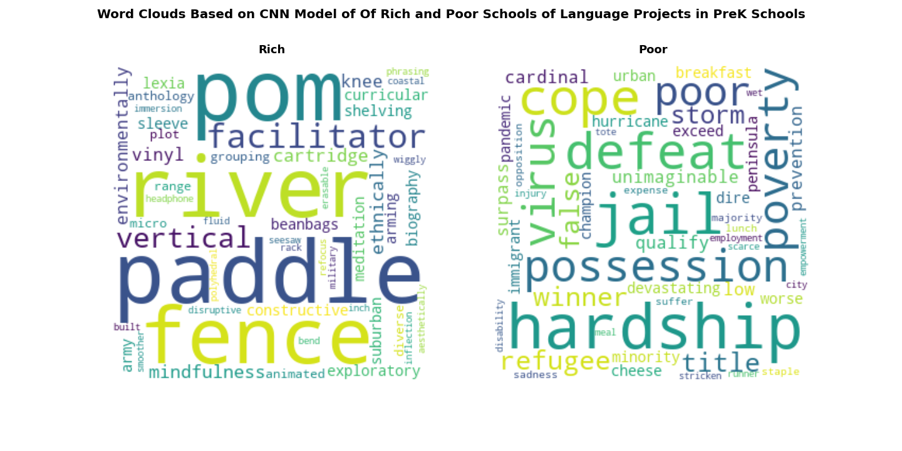

***Science Projects in PreK Schools (Accuracy 80.13%)***
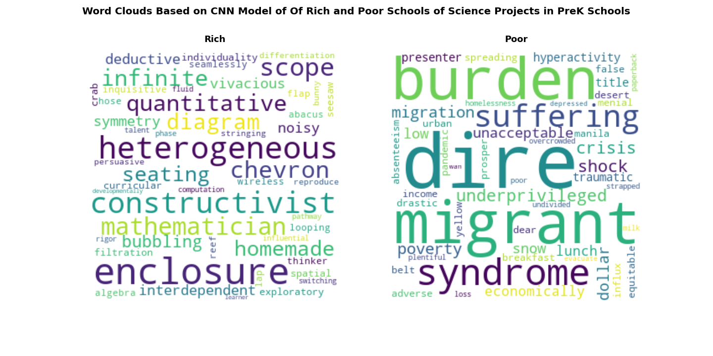

***Other Projects in PreK Schools (Accuracy 77.10%)***
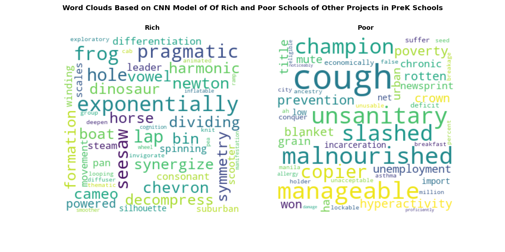

***Language Projects In Primary Schools (Accuracy 78.02%)***
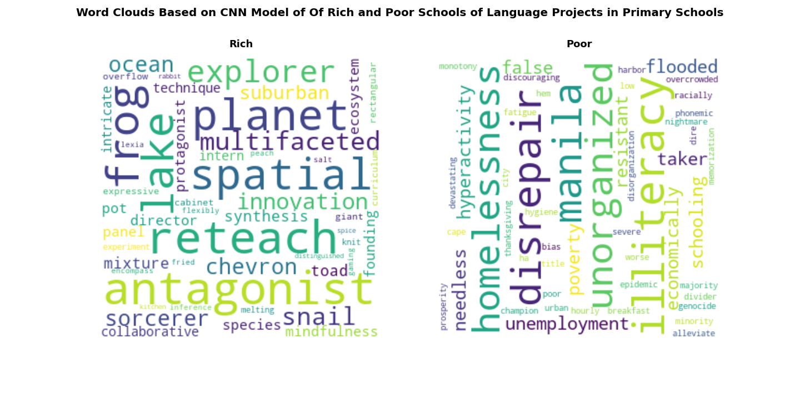

***Science Projects In Primary Schools (Accuracy 79.38%)***
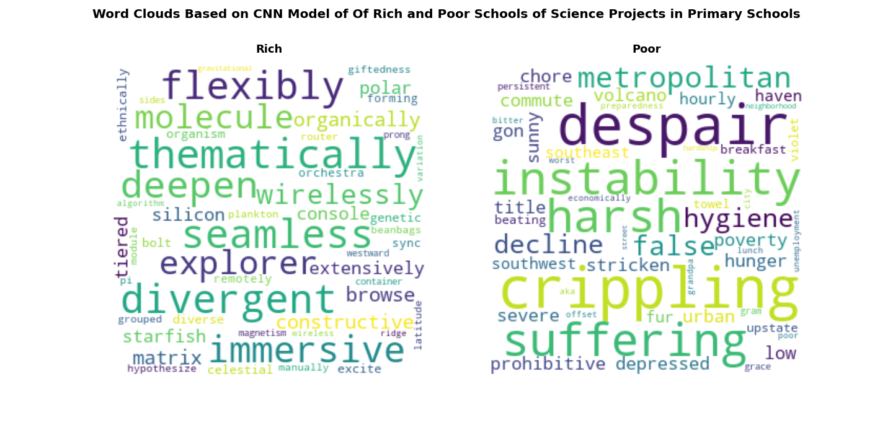

***Other Projects In Primary Schools (Accuracy 77.10%)***
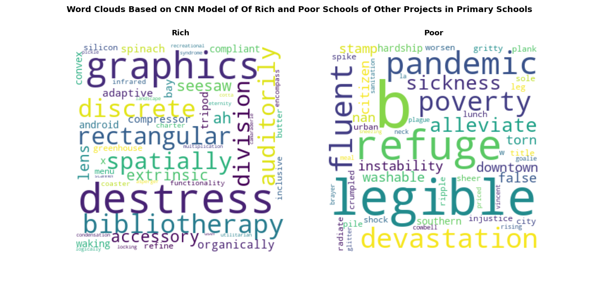

***Language Projects In Secondary Schools (Accuracy 82.50%)***
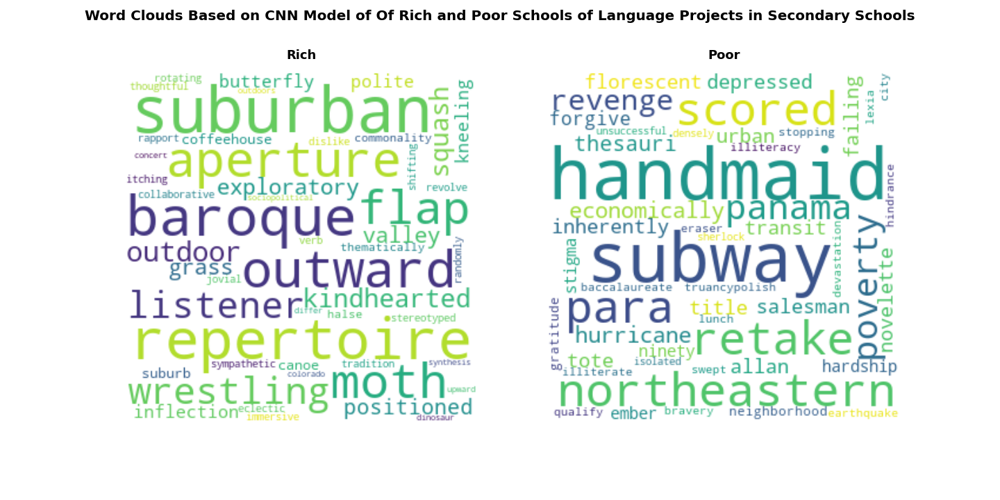

***Science Projects In Secondary Schools (Accuracy 79.10%)***
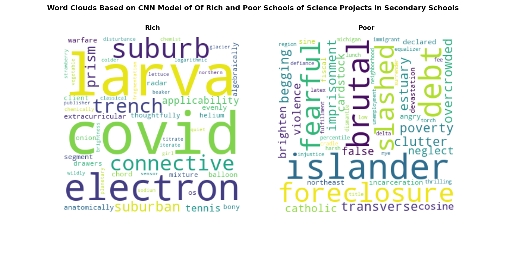

***Other Projects In Secondary Schools (Accuracy 77.94%)***
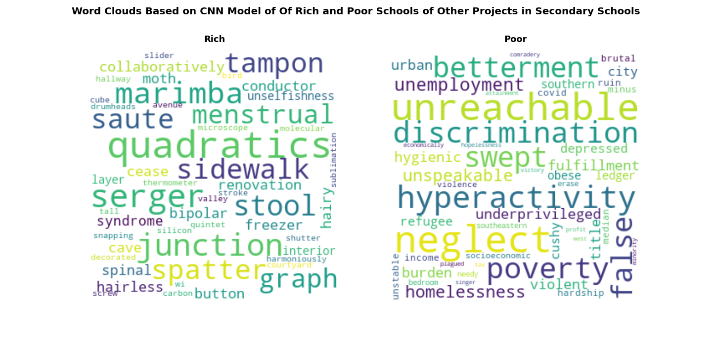

#### WordClouds for States with Small Education Gap
***Language Projects in PreK Schools (Accuracy 80.74%)***
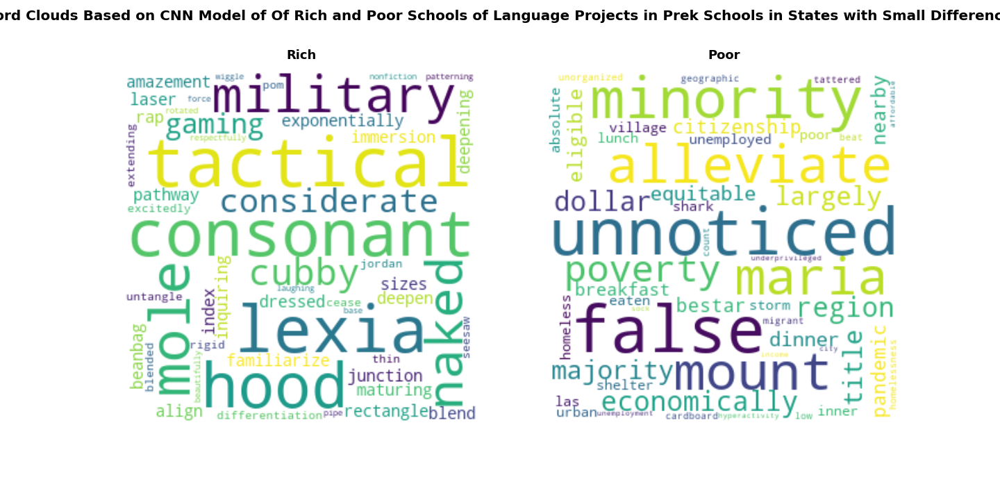

***Science Projects in PreK Schools (Accuracy 80.72%)***
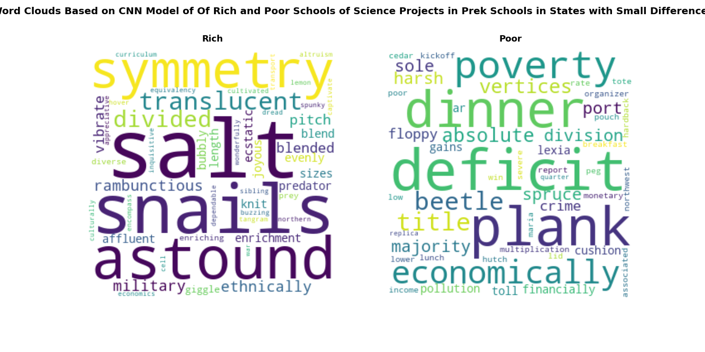

***Other Projects in PreK Schools (Accuracy 79.09%)***
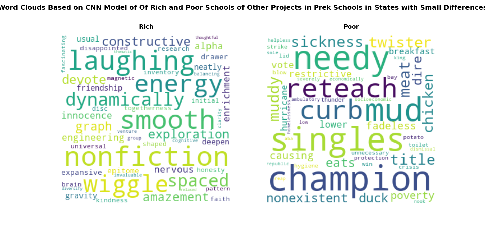

***Language Projects In Primary Schools (Accuracy 79.74%)***
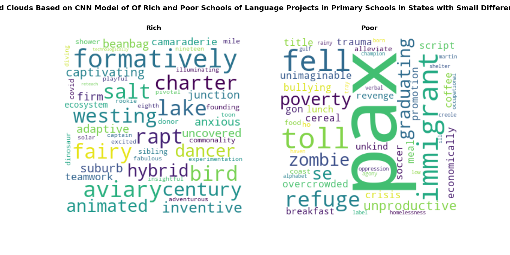

***Science Projects In Primary Schools (Accuracy 78.36%)***
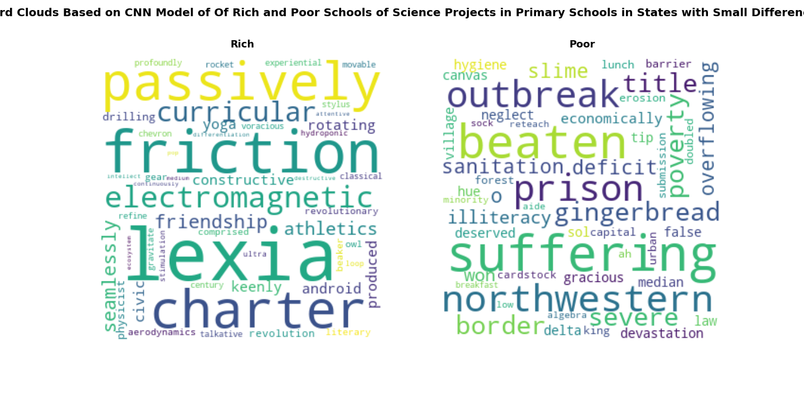

***Other Projects In Primary Schools (Accuracy 79.63%)***
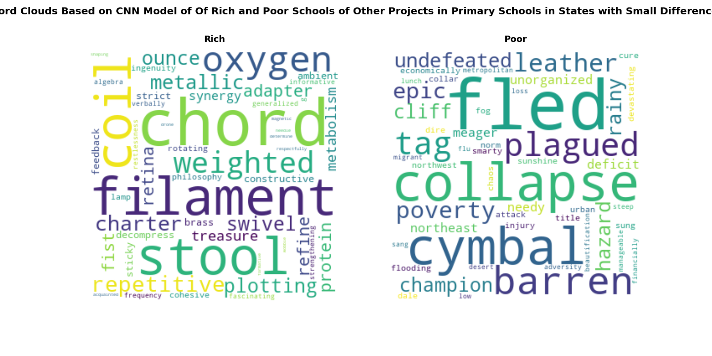

#### WordClouds for States with Big Education Gap
***Language Projects in PreK Schools (Accuracy 74.72%)***
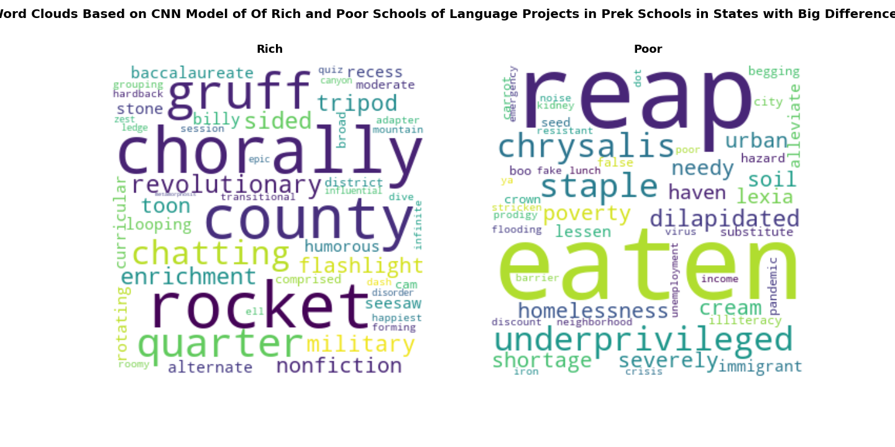

***Science Projects in PreK Schools (Accuracy 77.43%)***
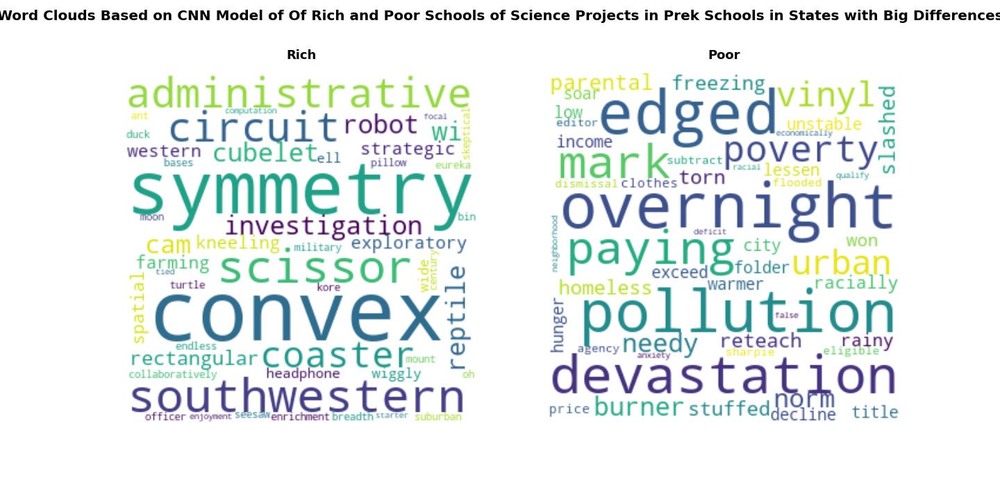

***Other Projects in PreK Schools (Accuracy 77.74%)***
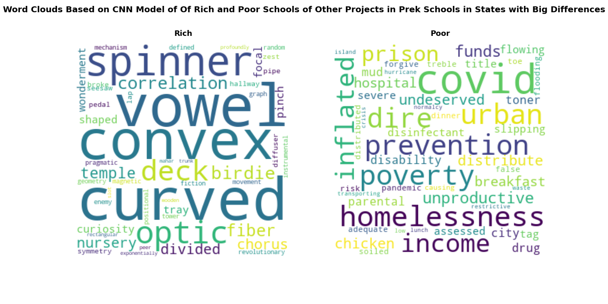

***Language Projects In Primary Schools (Accuracy 78.76%)***
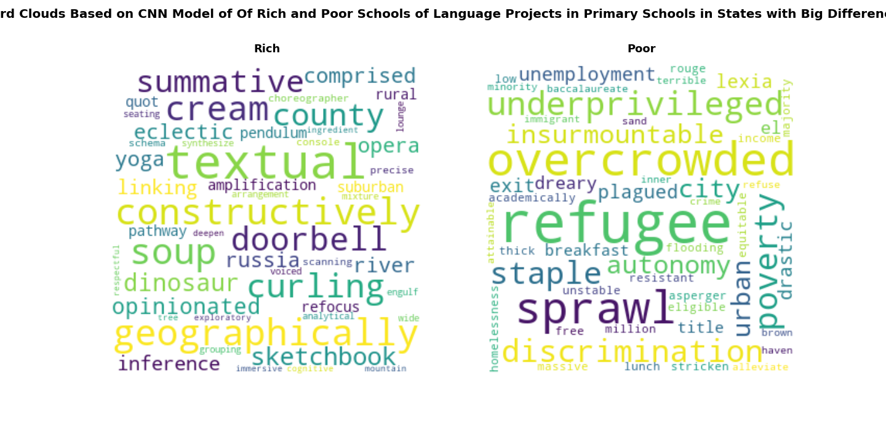

***Science Projects In Primary Schools (Accuracy 75.64%)***
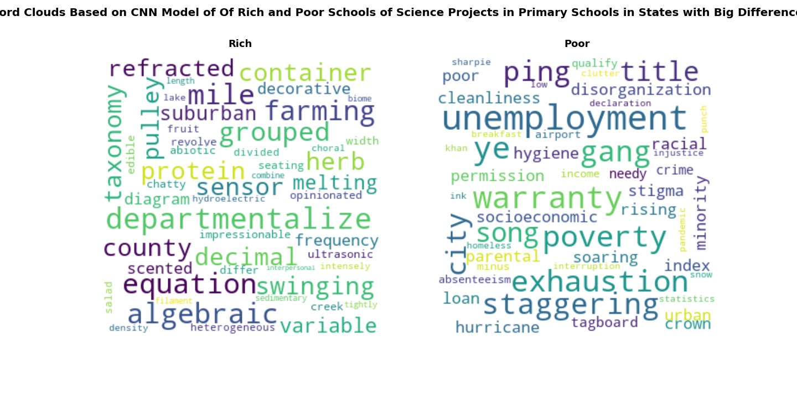

***Other Projects In Primary Schools (Accuracy 77.77%)***
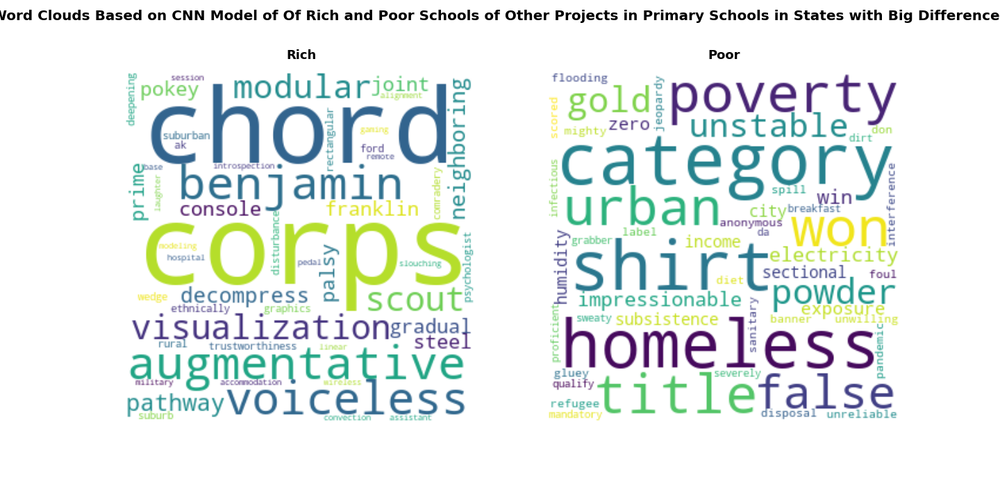

### BERT Sentence Classification
Work in progress.\
Use this [method](https://huggingface.co/sentence-transformers).

<!-- [More detail is available here](./docs/DESCRIPTION.md) -->

## Authors

<!--  -->

- **Zhen Yuan** - [GitHub](https://github.com/zyuan-mkt)

## Acknowledgments

- We appreciate DonorsChoose.org and Stanford SEDA providing the data.

