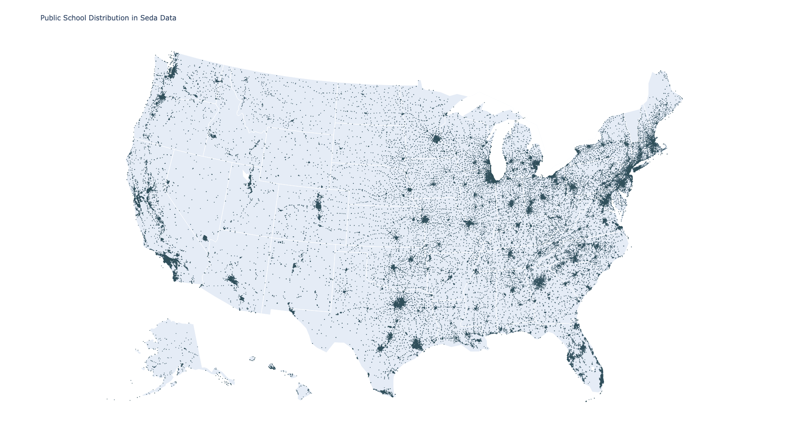
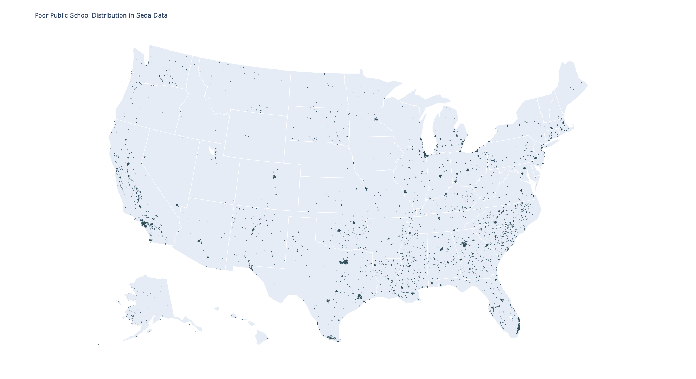
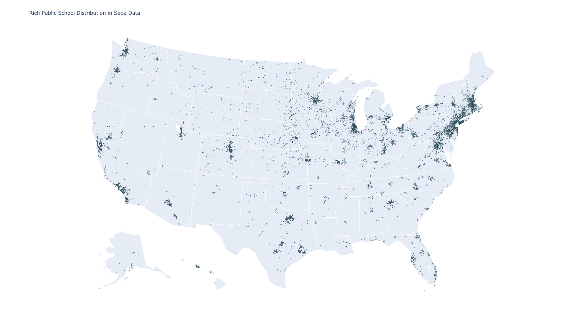

# Socioeconomics and Writing Styles

<!--    -->

This is the GitHub repository for Vishal Singh, Jeremy Yang and Zhen Yuan's paper Socioeconomics & Writing Styles: An analysis of US Public School Teachers. The draft is still in preparation. If you have any comments or questions, please contact [Zhen Yuan](https://www.yuan-zhen.com/).

<!-- > If you're new to open source, please consider taking the [free "Introduction to Open Source" class](https://cognitiveclass.ai/courses/introduction-to-open-source). -->
> 
<!-- >  -->

<!-- _Read this in other languages: [English](README.md), [한국어](./docs/README.ko.md), [português](./docs/README.pt_br.md)._ -->

## Contents

- [Socioeconomics and Writing Styles](#socioeconomics-and-writing-styles)
  - [Contents](#contents)
  - [Introduction](#introduction)
  - [Data](#data)
    - [SEDA Data](#seda-data)
    - [DonorsChoose Data](#donorschoose-data)
  - [Structured Analysis](#structured-analysis)
  - [Unstructured Analysis](#unstructured-analysis)
    - [CNN Classification](#cnn-classification)
    - [BERT Sentence Classification](#bert-sentence-classification)
  - [Authors](#authors)
  - [Acknowledgments](#acknowledgments)
## Introduction

## Data
### SEDA Data

#### Description
We use data from the Stanford Education Data Archive (SEDA) to measure the educational and economic gaps between rich schools and poor schools across the US. SEDA contains data about test scores for schools, geographically defined school districts, counties, commuting zones, metropolitan statistical areas, and states. The data spans from 3rd to 8th grade and from 2008-09 to 2017-18 school years. Besides, it also provides information of socioeconomic, demographic, and segregation characteristics of schools, districts, counties, metropolitan areas, and states. The school is uniquely identified by the 12-digit NCES school ID (ncessch), which is used to link the DonorsChoose data. 

SEDA includes 82357 Public Elementary/Secondary Schools in the US. The table below reports number of schools in the nine divisions defined by United States Census Bureau.

| Division           | Num of Schools         | High | Medium-high | Medium-low | Low |
|--------------------|--------------------|-----------------|------------------------|-----------------------|----------------|
| East North Central | 13180              | 2422            | 2743                   | 4837                  | 3178           |
| South Atlantic     | 12492              | 2853            | 3927                   | 3630                  | 2082           |  
| Pacific            | 12109              | 2322            | 3786                   | 3350                  | 2651           |  
| West South Central | 11027              | 2564            | 4037                   | 3081                  | 1345           |
| Middle Atlantic    | 8578               | 1517            | 1517                   | 2542                  | 3002           |  
| West North Central | 8084               | 789             | 1320                   | 3467                  | 2508           |
| Mountain           | 7016               | 968             | 1605                   | 2531                  | 1912           |   
| East South Central | 4698               | 1136            | 1823                   | 1362                  | 377            | 
| New England        | 3876               | 328             | 615                    | 1220                  | 171            |      

#### Covariates

The school level income & poverty measure we use is the free or reduced-price lunch (FRPL) ratio of students. Low-poverty schools are defined as public schools where 25.0 percent or less of the students are eligible for FRPL; mid-low poverty schools are those where 25.1 to 50.0 percent of the students are eligible for FRPL; mid-high poverty schools are those where 50.1 to 75.0 percent of the students are eligible for FRPL; and high-poverty schools are those where more than 75.0 percent of the students are eligible for FRPL.

The academic performance includes mathematics and Reading Language Arts (RLA) tests. States have the flexibility to select or design a test of their choice that measures student achievement relative to the state’s standards. Meanwhile, they set their own benchmarks or threshold for the levels of performance. For the purpose of national comparable scales, the test scores were estimated and standardized for each subgroup in each unit (schools, geographic school districts, counties, metropolitan areas, commuting zones, or states) across subjects, grades, and years. 

#### Visualizations

***Public School Distribution in US***: 69280 schools with coordinates

***Poor Public School Distribution in US***: 12149 poor schools with coordinates

***Rich Public School Distribution in US***: 16360 poor schools with coordinates

### DonorsChoose Data

#### Description
It seems that Stanford data only report the public schools. However, since this dataset does not include kindergardens, there were 50,000 rows of "prek-2" observations dropped. Stanford report of the grade level is different to that of Donorschoose. Then we consider standardize the level: elementary, middle, and high.

There are 52316 schools in the original DonorsChoose dataset (with school id), and 89350 schools in the Stanford dataset. After merging these two, we have 40417 schools in common.

Math and RLA (Reading Language Arts) scores were standardized with mean -0.0458 and standard deviation 0.446. The difference in Math and RLA score was standardized
to -0.00507 and standard deviation 0.146. However, math and rla scores could hardly explain the number of posts by states.

#### Projects 

***Description Table***
|   | GRADE     | SUBJECT  | projects_0.0 | projects_1.0 | Classification    | price_0.0 | price_1.0 | students_0.0 | students_1.0 | projects_ratio | price_ratio | students_ratio |
|---|-----------|----------|--------------|--------------|--------------|-----------|-----------|--------------|--------------|----------------|-------------|----------------|
| 0 | PreK-2    | Language | 37869        | 264269       |   79.40%      | 542.94    | 503.54    | 38.94        | 39.37        | 6.98           | 0.93        | 1.01  
| 1 | PreK-2    | Science  | 20137        | 114351       |   80.13%   |601.05    | 539.14    | 48.51        | 45.92        | 5.68           | 0.9         | 0.95           ||
| 2 | PreK-2    | Others   | 24403        | 171853       |  77.10%      | 527.0     | 502.92    | 68.66        | 72.86        | 7.04           | 0.95        | 1.06           |
| 3 | Primary   | Language | 38200        | 261611       |   78.02%      | 580.22    | 542.18    | 84.36        | 79.84        | 6.85           | 0.93        | 0.95           |
| 4 | Primary   | Science  | 39155        | 212684       |  79.38%     |724.95    | 657.86    | 122.53       | 106.96       | 5.43           | 0.91        | 0.87           | 
| 5 | Primary   | Others   | 31426        | 201932       |     77.10%      |662.9     | 634.02    | 183.21       | 172.62       | 6.43           | 0.96        | 0.94           |
| 6 | Secondary | Language | 3954         | 43889        |    82.50%      |628.36    | 643.47    | 168.95       | 134.89       | 11.1           | 1.02        | 0.8            |
| 7 | Secondary | Science  | 6547         | 55449        |    79.10%      |1030.85   | 814.34    | 158.4        | 133.78       | 8.47           | 0.79        | 0.84           | 
| 8 | Secondary | Others   | 5589         | 65247        |    77.94%        |951.69    | 849.77    | 164.16       | 159.68       | 11.67          | 0.89        | 0.97           |

***Description Table of Bot 10 States with most significant Difference between Poor and Rich Schools***
|   | SUBJECT  | GRADE     | project_high | project_low |  Classification    |price_high         | price_low          | student_high       | student_low        |
|---|----------|-----------|--------------|-------------|---------------|-------------------|--------------------|--------------------|--------------------|
| 0 | Language | PreK-2    | 63796        | 10356       | 80.74%| 501.62070537337763 | 517.2745867130167  | 39.92334462001505  | 40.157701593433124 |
| 1 | Science  | PreK-2    | 28512        | 5463        | 80.72%| 544.426897446689   | 552.2683635365183  | 47.419171547823645 | 47.48782720117152  |
| 2 | Others   | PreK-2    | 35355        | 5251        | 79.09%| 501.33112317918255 | 494.78652637592836 | 87.16569553657295  | 74.57306153553057  |
| 3 | Language | Primary   | 60965        | 10285       | 79.74%| 532.3124586238006  | 534.4318580456976  | 100.70158948870626 | 79.1507049100632   |
| 4 | Science  | Primary   | 51370        | 10650       | 78.36%| 641.9456513529298  | 649.9050460093897  | 110.65440174434451 | 115.59661971830985 |
| 5 | Others   | Primary   | 42890        | 7547        | 79.63%| 627.6698880858008  | 611.9164157943554  | 214.0482408076663  | 203.62037895852657 |
| 6 | Language | Secondary | 7316         | 725         | NA |  601.6777569710224  | 579.1004551724138  | 145.68630399125206 | 178.63862068965517 |
| 7 | Science  | Secondary | 10032        | 911         | NA |  774.2164872408293  | 1044.5594621295281 | 141.71082535885168 | 165.9297475301866  |
| 8 | Others   | Secondary | 11362        | 1062        | NA |  935.178029396233   | 1060.8329943502824 | 143.30058973681895 | 164.47175141242937 |

### Description Table of Top 10 States with most significant Difference between Poor and Rich Schools

|   | SUBJECT  | GRADE     | project_high | project_low | Classification  | price_high         | price_low          | student_high       | student_low        |
|---|----------|-----------|--------------|-------------|-------------|--------------------|--------------------|--------------------|--------------------|
| 0 | Language | PreK-2    | 50939        | 6620        | 74.72%| 492.84362021241094 | 510.503003021148   | 39.52513889706893  | 39.08522212148685  |
| 1 | Science  | PreK-2    | 22367        | 3156        | 77.43%| 535.0324849108061  | 537.1058935361217  | 43.5677560692091   | 50.47877059569075  |
| 2 | Others   | PreK-2    | 32908        | 4524        | 77.74%| 500.0273915157409  | 504.27066755083996 | 69.22383614926461  | 79.00707338638374  |
| 3 | Language | Primary   | 45980        | 6878        | 78.76%| 529.6994858634189  | 545.404789182902   | 77.73422071425465  | 97.71495055264688  |
| 4 | Science  | Primary   | 40114        | 6216        | 75.64%| 622.3851730069302  | 686.7385006435005  | 98.96377552292388  | 121.85358004827032 |
| 5 | Others   | Primary   | 36708        | 5788        | 77.77%| 599.5132709491119  | 635.0813251554941  | 175.01122493461204 | 187.6055632342778  |
| 6 | Language | Secondary | 8096         | 802         | NA | 612.6110783102766  | 561.5047506234414  | 131.51550339715874 | 169.91895261845386 |
| 7 | Science  | Secondary | 8500         | 1098        |  NA | 809.3969917647058  | 1149.372122040073  | 127.5353654230905  | 140.79781420765028 |
| 8 | Others   | Secondary | 11292        | 1121        |  NA | 859.5557952532765  | 991.54409455843    | 141.64895501239815 | 165.5834076717217  |

## Structured Analysis

<!--  -->

## Unstructured Analysis

### CNN Classification
You can find the code at [this page](CNN_Wordcloud.ipynb).
You can find the results at [this page](wordcloud.md).
### BERT Sentence Classification
Work in progress.

<!-- [More detail is available here](./docs/DESCRIPTION.md) -->

## Authors

<!--  -->

- **Zhen Yuan** - [GitHub](https://github.com/zyuan-mkt)

## Acknowledgments

- We appreciate DonorsChoose.org and Stanford SEDA providing the data.

