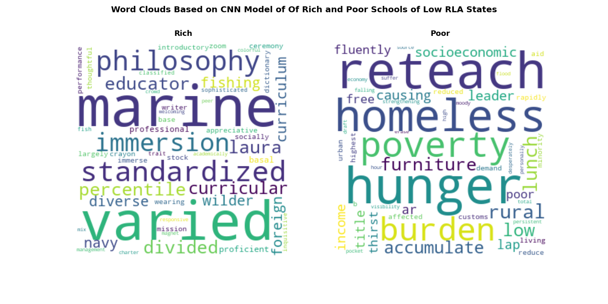
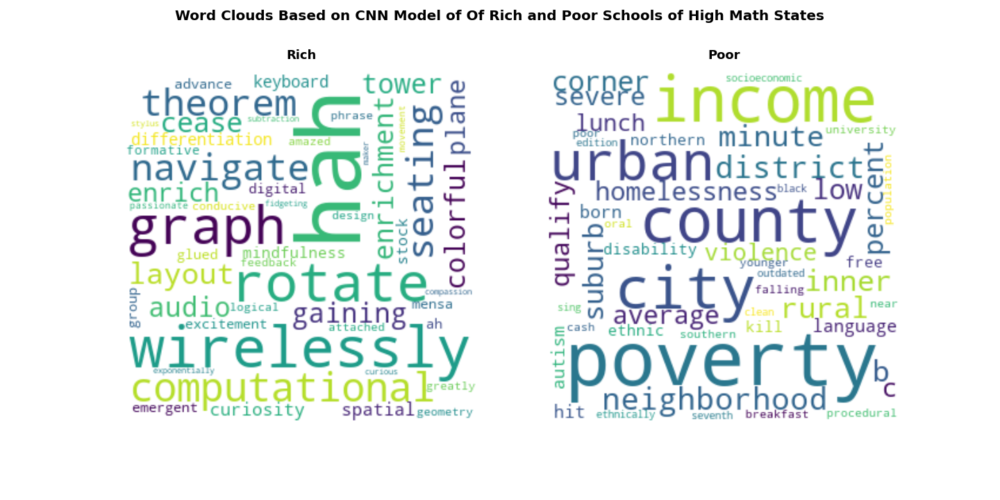
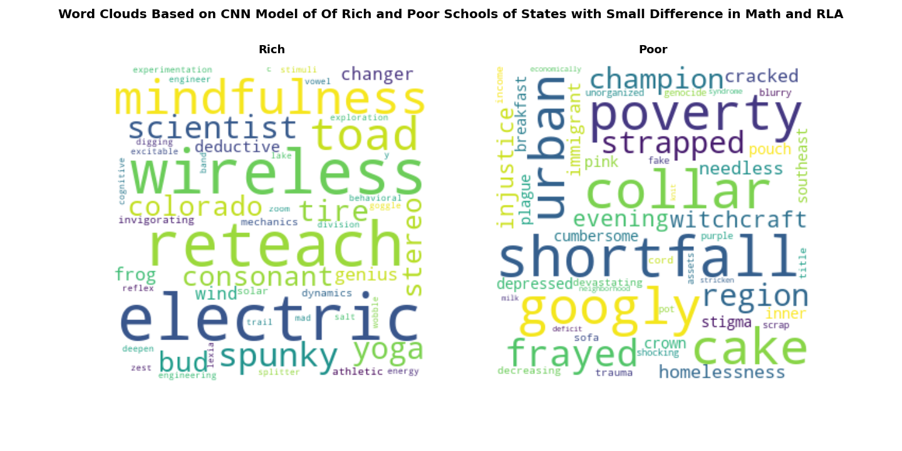

# DonorsChoose Data

### Description Table
|   | GRADE     | SUBJECT  | projects_0.0 | projects_1.0 | price_0.0 | price_1.0 | students_0.0 | students_1.0 | projects_ratio | price_ratio | students_ratio |
|---|-----------|----------|--------------|--------------|-----------|-----------|--------------|--------------|----------------|-------------|----------------|
| 0 | PreK-2    | Language | 37869        | 264269       | 542.94    | 503.54    | 38.94        | 39.37        | 6.98           | 0.93        | 1.01           |
| 1 | PreK-2    | Others   | 24403        | 171853       | 527.0     | 502.92    | 68.66        | 72.86        | 7.04           | 0.95        | 1.06           |
| 2 | PreK-2    | Science  | 20137        | 114351       | 601.05    | 539.14    | 48.51        | 45.92        | 5.68           | 0.9         | 0.95           |
| 3 | Primary   | Language | 38200        | 261611       | 580.22    | 542.18    | 84.36        | 79.84        | 6.85           | 0.93        | 0.95           |
| 4 | Primary   | Others   | 31426        | 201932       | 662.9     | 634.02    | 183.21       | 172.62       | 6.43           | 0.96        | 0.94           |
| 5 | Primary   | Science  | 39155        | 212684       | 724.95    | 657.86    | 122.53       | 106.96       | 5.43           | 0.91        | 0.87           |
| 6 | Secondary | Language | 3954         | 43889        | 628.36    | 643.47    | 168.95       | 134.89       | 11.1           | 1.02        | 0.8            |
| 7 | Secondary | Others   | 5589         | 65247        | 951.69    | 849.77    | 164.16       | 159.68       | 11.67          | 0.89        | 0.97           |
| 8 | Secondary | Science  | 6547         | 55449        | 1030.85   | 814.34    | 158.4        | 133.78       | 8.47           | 0.79        | 0.84           |


## Stanford Data

### The Academic Performance of Rich and Poor Schools

It seems that Stanford data only report the public schools.

There are 52316 schools in the original DonorsChoose dataset (with school id), and 89350 schools in the Stanford dataset. After merging these two, we have 40417 schools in common.

Math and RLA (Reading Language Arts) scores were standardized with mean -0.0458 and standard deviation 0.446. The difference in Math and RLA score was standardized
to -0.00507 and standard deviation 0.146. However, math and rla scores could hardly explain the number of posts by states.
- ***Math and RLA Scores Across States***
<p align="center">
  
</p>

- ***Math and RLA Difference Across States***
<p align="center">
  
</p>


- ***Math and RLA Scores of High Poverty versus Low Poverty***
<p align="center">
  
  
</p>

- ***Difference between Math and RLA of High Poverty and Low Poverty***
<p align="center">
  
  
</p>

- ***Difference in Math and RLA between High Poverty and Low Poverty***
<p align="center">
  
</p>

## DonorsChoose Data

### Word Clouds of Rich Schools versus Poor Schools

***Overall: Test Loss: 0.469 | Test Acc: 80.00%***


***Pre-Covid: Test Loss: 0.486 | Test Acc: 79.29%***


***Post-Covid: Test Loss: 0.540 | Test Acc: 71.42%***


***Entertainment: Test Loss: 0.470 | Test Acc: 78.75%***


***Technology: Test Loss: 0.496 | Test Acc: 77.94%***


***Supplies: Test Loss: 0.471 | Test Acc: 77.94%***


***Visits: Test Loss: 0.460 | Test Acc: 77.75%***


***Arts: Test Loss: 0.498 | Test Acc: 77.98%***


***PreK - 2: Test Loss: 0.453 | Test Acc: 81.35%***


***Grade 3 - 5: Test Loss: 0.558 | Test Acc: 71.33%***


***Grade 6 - 8: Test Loss: 0.598 | Test Acc: 67.77%***


***Grade 9 - 12: Test Loss: 0.516 | Test Acc: 76.77%***


***Male: Test Loss: 0.363 | Test Acc: 85.21%***


***Female: Test Loss: 0.468 | Test Acc: 81.58%***


### Next I collected the projects related to math and literacy from grade 3 - 8 in the five states respectively with highest and lowest scores. I found that the algorithm is better at predicting rich and poor in high-score states

***Low RLA: Test Loss: 0.544 | Test Acc: 72.97%***


***High RLA: Test Loss: 0.485 | Test Acc: 76.59%***


***Low Math: Test Loss: 0.492 | Test Acc: 74.53%***


***High Math: Test Loss: 0.419 | Test Acc: 81.57%***



### Difference in Difference 

```DID = (math_{rich}-math_{poor}) - (rla_{rich}-rla_{poor})```


***Small Difference RLA: Test Loss: 0.422 | Test Acc: 80.43%***


***Small Difference Math: Test Loss: 0.362 | Test Acc: 85.29%***


***Big Difference RLA: Test Loss: 0.471 | Test Acc: 77.67%***


***Big Difference Math: Test Loss: 0.464 | Test Acc: 78.76%***


