#### ROC for Overall 

***Language Projects in PreK Schools (Accuracy 79.40%)***
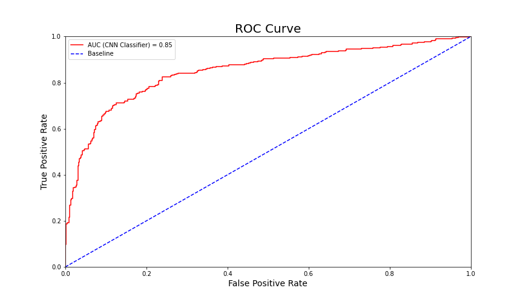

***Science Projects in PreK Schools (Accuracy 80.13%)***
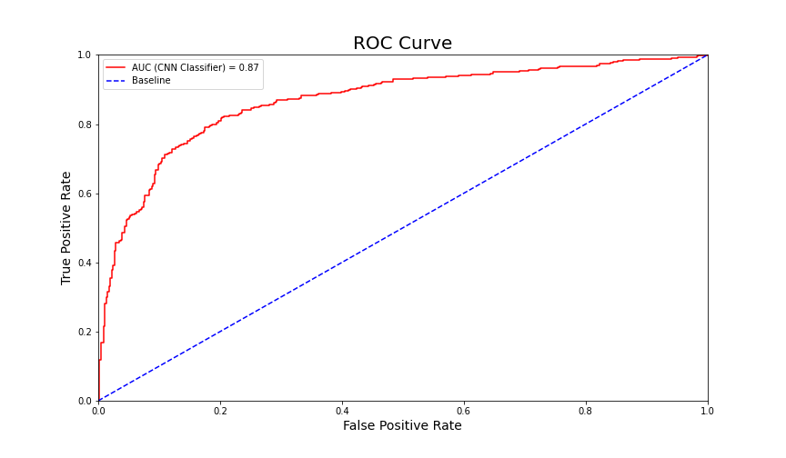

***Other Projects in PreK Schools (Accuracy 77.10%)***
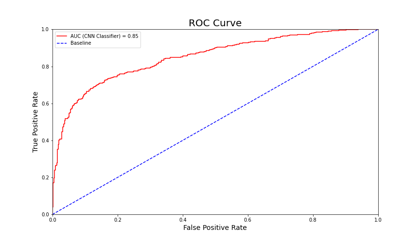

***Language Projects In Primary Schools (Accuracy 78.02%)***
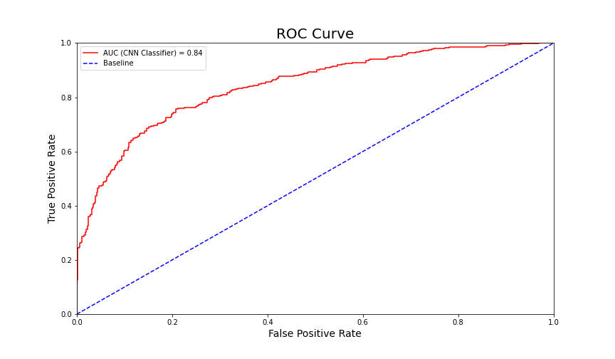

***Science Projects In Primary Schools (Accuracy 79.38%)***

***Other Projects In Primary Schools (Accuracy 77.10%)***
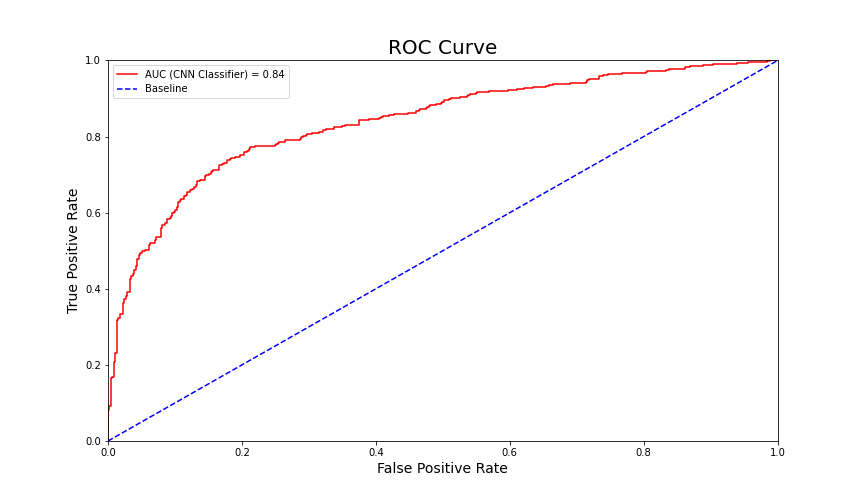

***Language Projects In Secondary Schools (Accuracy 82.50%)***
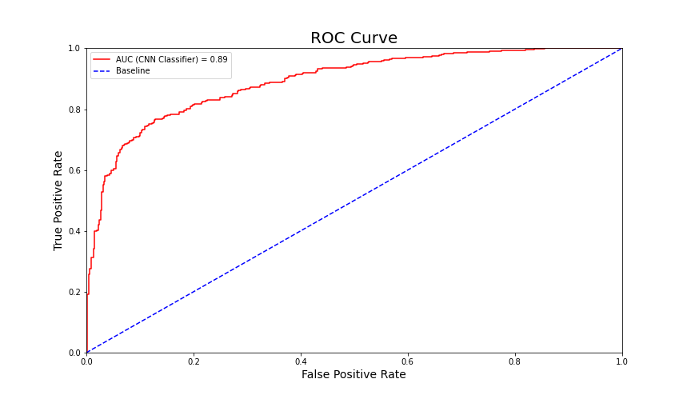

***Science Projects In Secondary Schools (Accuracy 79.10%)***
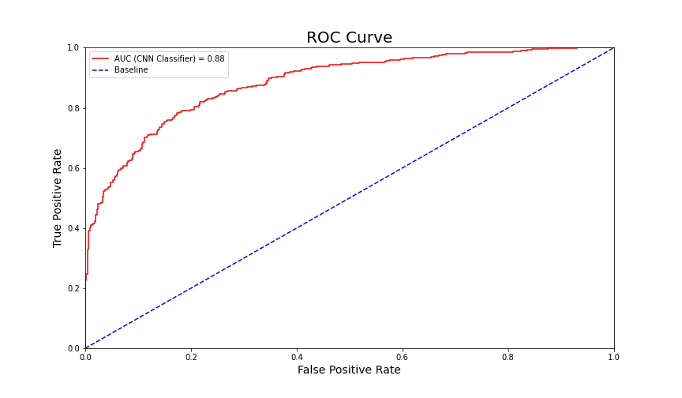

***Other Projects In Secondary Schools (Accuracy 77.94%)***
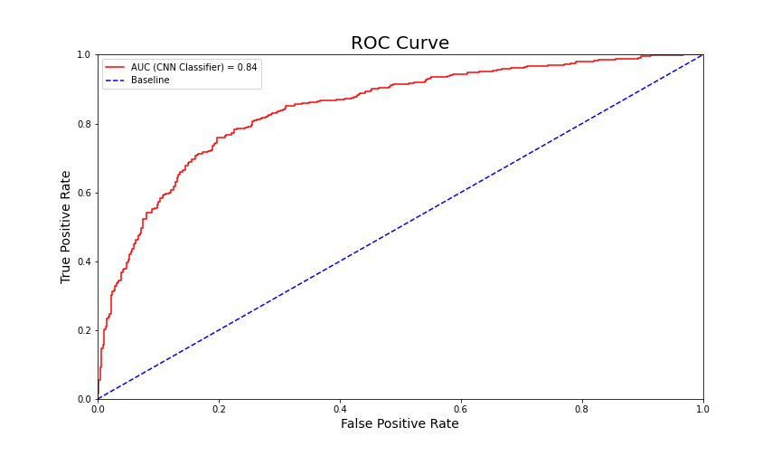

#### ROC for States with Small Education Gap
***Language Projects in PreK Schools (Accuracy 80.74%)***
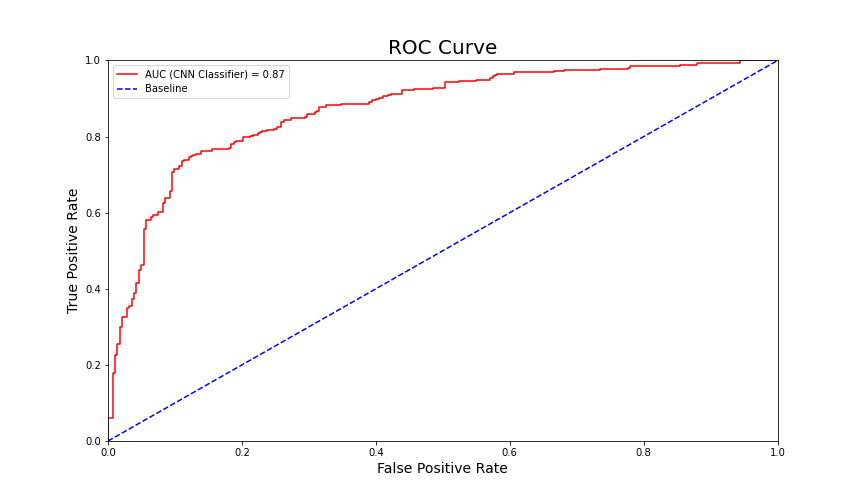

***Science Projects in PreK Schools (Accuracy 80.72%)***
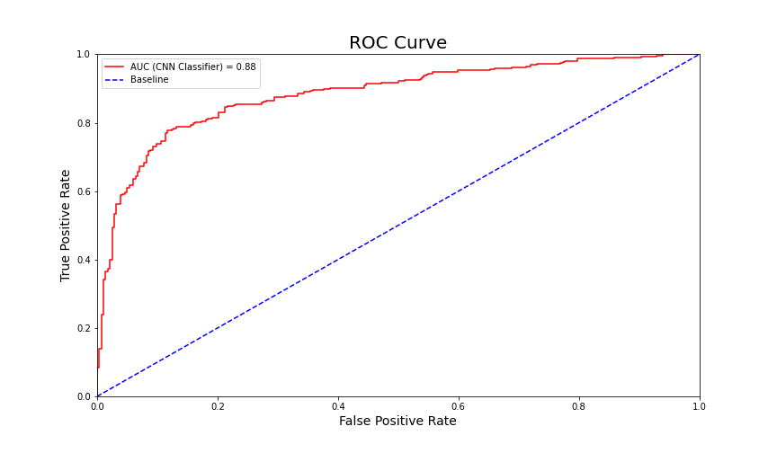

***Other Projects in PreK Schools (Accuracy 79.09%)***
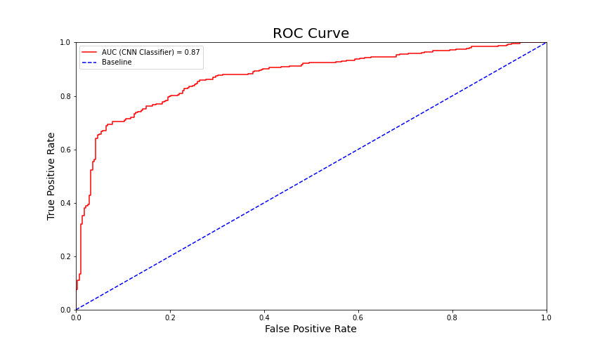

***Language Projects In Primary Schools (Accuracy 79.74%)***

***Science Projects In Primary Schools (Accuracy 78.36%)***
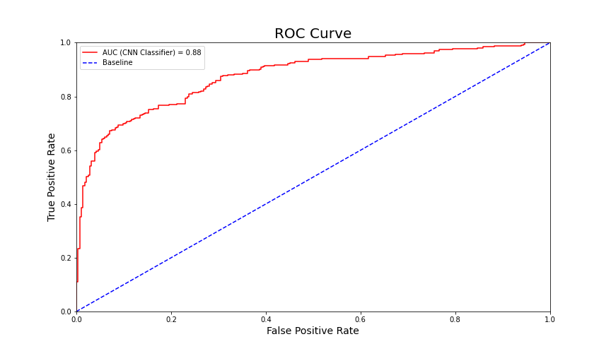

***Other Projects In Primary Schools (Accuracy 79.63%)***
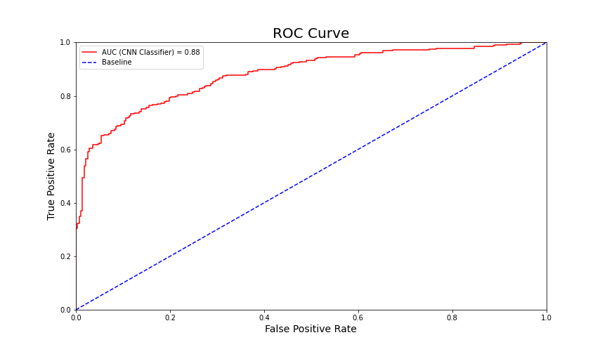

#### ROC for States with Big Education Gap
***Language Projects in PreK Schools (Accuracy 74.72%)***
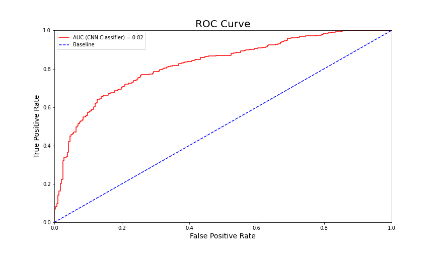

***Science Projects in PreK Schools (Accuracy 77.43%)***
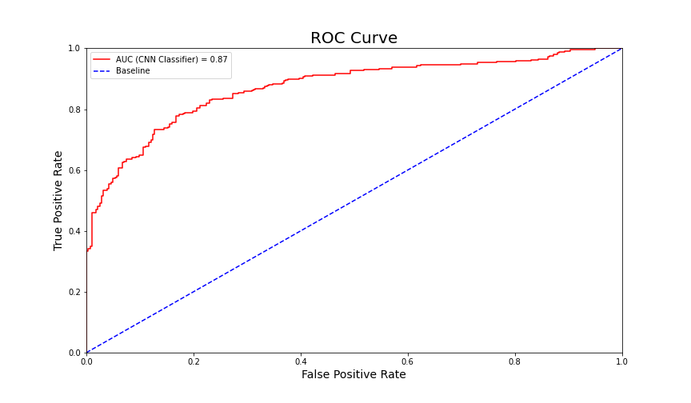

***Other Projects in PreK Schools (Accuracy 77.74%)***
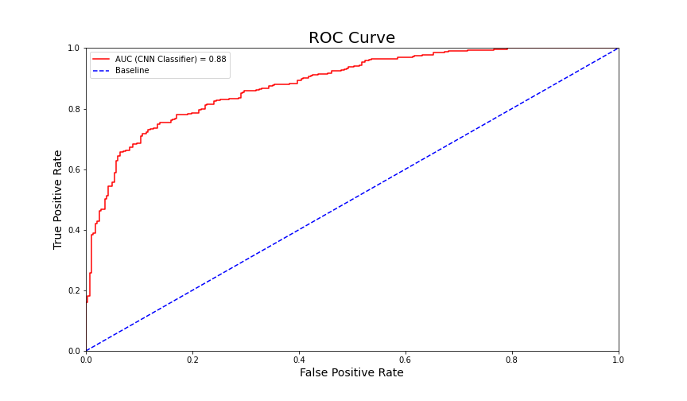

***Language Projects In Primary Schools (Accuracy 78.76%)***
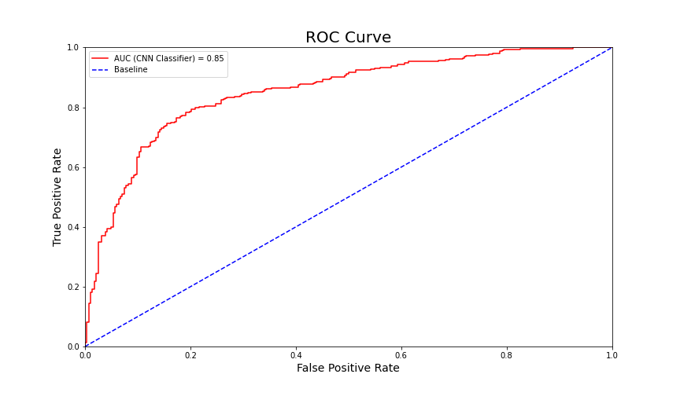

***Science Projects In Primary Schools (Accuracy 75.64%)***
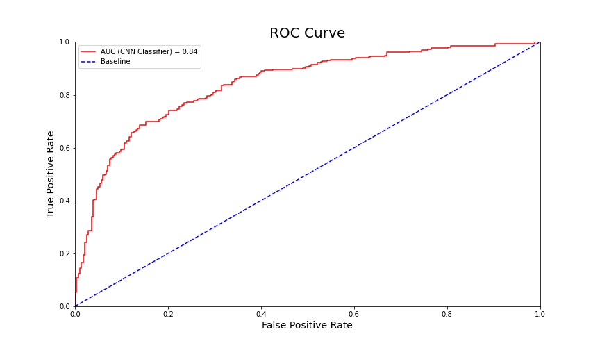

***Other Projects In Primary Schools (Accuracy 77.77%)***
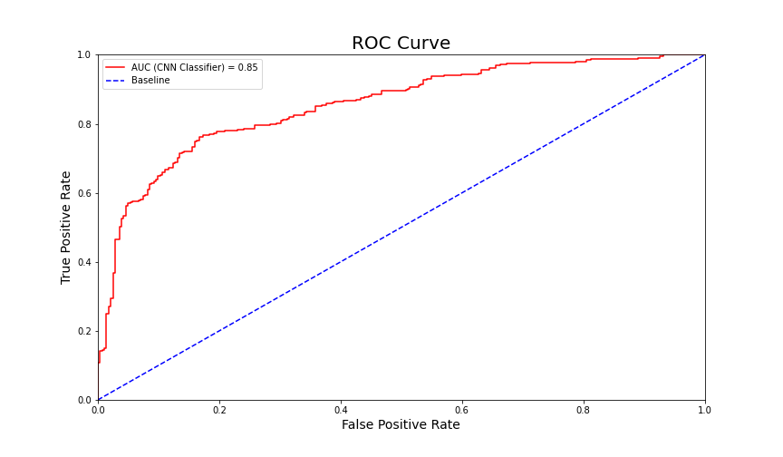
