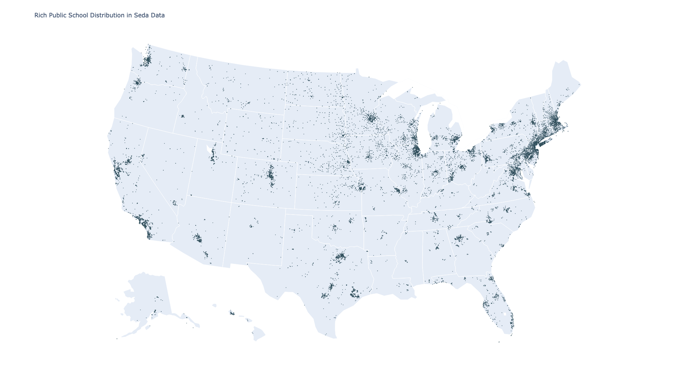
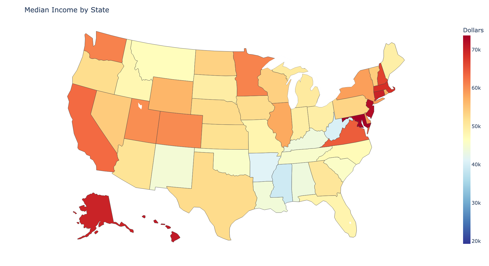
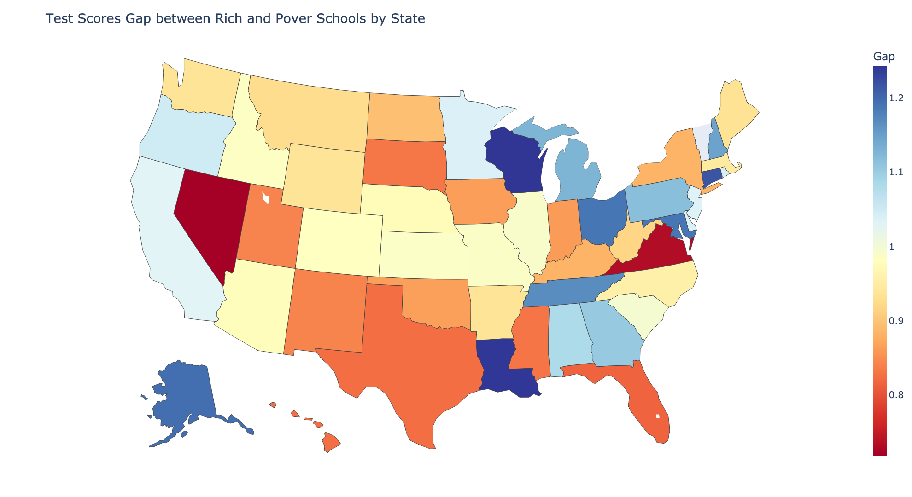

## SEDA Visualization

### Public School Distribution in US
***There are 82357 schools in the SEDA data. The ten states with most public schools are California (8508), Texas (7219), New York (2595), Illinois (3436), Florida (3298), Ohio (3178), Michigan (3068), Pennsylvania (2819), North Carolina (2174), and New Jersey (1991).***

### Poor Public School Distribution in US: 
***There are 16196 poor schools (free or reduced-price lunch ratio greater or equal to 75%) in the SEDA data. The ten states with most public schools (except Puerto Rico) are California (2022), Texas (1572), New York (793), Florida (783), Illinois (753), Georgia (688), Ohio (661), Michigan (629), Louisiana (552), and North Carolina (546).***

### Rich Public School Distribution in US
***There are 18768 rich schools (free or reduced-price lunch ratio lower or equal to 75%) in the SEDA data. The ten states with most public schools are California (1819), New York (1085), New Jersey (1059), Illinois (935), Pennsylvania (858), Massachusetts (791), Ohio (683), Minnesota (660), and Michigan (610).***

### State Average Free or Reduced-Price Lunch (FRL) Ratio
***The 5 states with highest FRL ratio (excluding Puerto Rico) are Washington DC (77.04%), Mississippi (73.39%), New Mexico (71.43%), Louisiana (66.98%) and Oklahoma (63.17%), while the 5 states with lowest FRL ratio are Connecticut (36.03%), New Jersey (35.86%), Massachusetts (35.86%), North Dakota (33.39%), New Hampshire (27.56%).***

### State Median Income (2005-2018 Average)
***The 5 states with highest median income are Maryland ($73,700), New Jersey ($72,195), Hawaii ($70,765), Connecticut ($69,843), and Alaska ($69,777), while the 5 states with lowest median income (excluding Puerto Rico) are Kentucky ($43,643), Alabama ($43,603), Arkansas ($41,190), West Virginia ($40,363), and Mississippi ($39,191). The correlation between state average FRL ratio and state average median income is -0.609.***

### Test Scores

### Difference

### Gap

