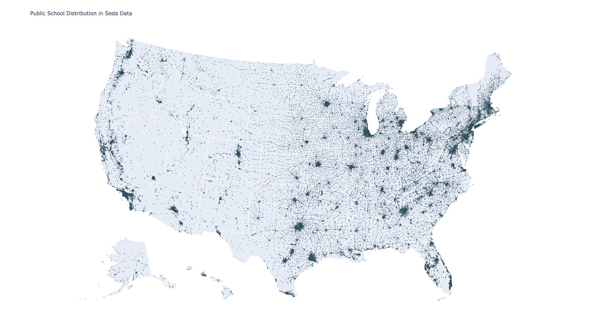
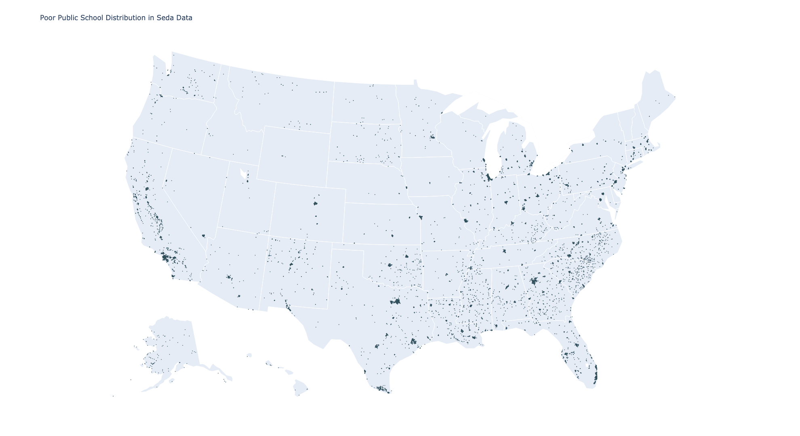

## SEDA Visualization

### Public School Distribution in US: 69280 schools with coordinates

### Poor Public School Distribution in US: 12149 poor schools with coordinates

### Rich Public School Distribution in US: 16360 poor schools with coordinates

### Free or Reduced Price Lunch 

### Median Income

### Test Scores

### Difference

### Gap

