<!-- 
***Overall***

The accuracy of states with small education gap is lower than that of states with big education gap. And the overall lies between.

***['pos_sec','pos_pri','pos_prek','neg_sec','neg_pri','neg_prek']***

Positive words: language>science>others; prek>primary>secondary

***['neg_pre_b', 'neg_pre_s','neg_pri_b','neg_pri_s','pos_pre_b', 'pos_pre_s','pos_pri_b', 'pos_pri_s']***

Rich schools in states with small education difference have more positive words than those with big education difference. For poor schools, there is no systematic variation.

***['prek_lan', 'prek_sci','prek_oth','pri_lan', 'pri_sci', 'pri_oth','sec_lan', 'sec_sci', 'sec_oth']***
Nothing interesting

***['lan_pre_s', 'sci_pre_s', 'oth_pre_s','lan_pri_s', 'sci_pri_s', 'oth_pri_s', \
'lan_pre_b', 'sci_pre_b','oth_pre_b', 'lan_pri_b', 'sci_pri_b', 'oth_pri_b']***

For small difference states, poor schools use more nouns, less adjectives, less adverb, and less verb than rich schools.
For rich difference states, poor schools use less nouns, less adjectives, less adverb, and less verb than rich schools. -->

## WordClouds for Overall 

### Language Projects in PreK Schools (Accuracy 79.40%)
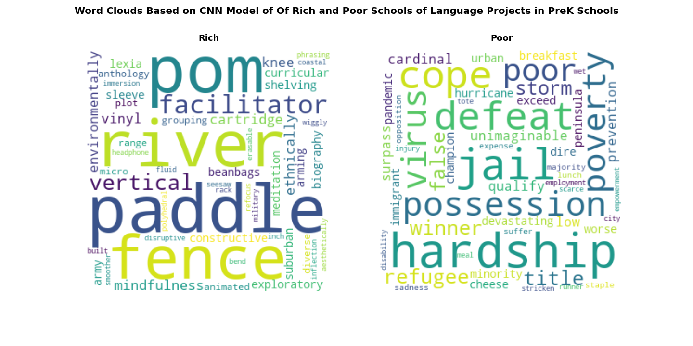

### Science Projects in PreK Schools (Accuracy 80.13%)

### Other Projects in PreK Schools (Accuracy 77.10%)
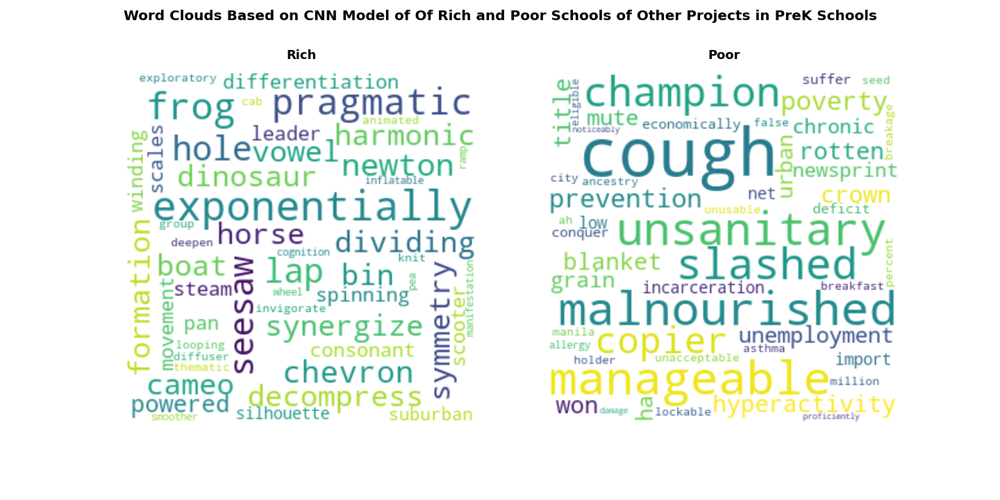

### Language Projects In Primary Schools (Accuracy 78.02%)

### Science Projects In Primary Schools (Accuracy 79.38%)
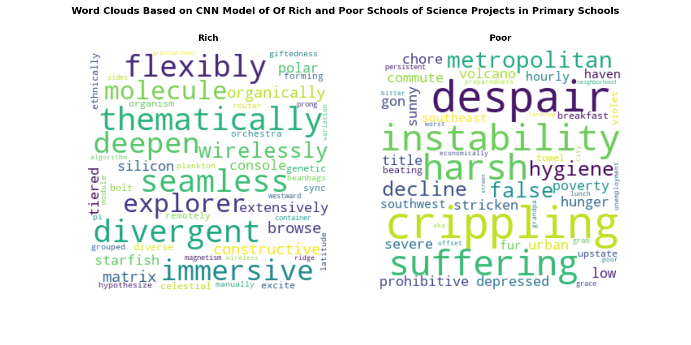

### Other Projects In Primary Schools (Accuracy 77.10%)
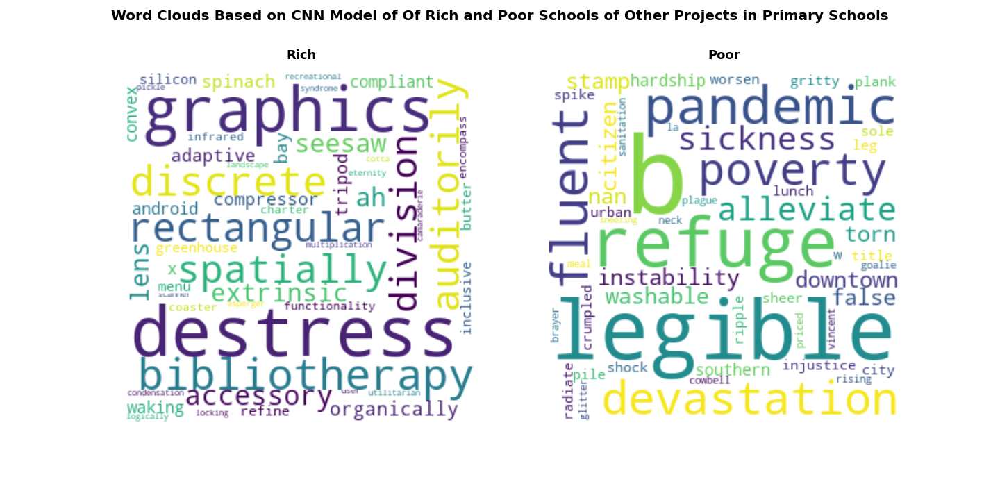

### Language Projects In Secondary Schools (Accuracy 82.50%)

### Science Projects In Secondary Schools (Accuracy 79.10%)
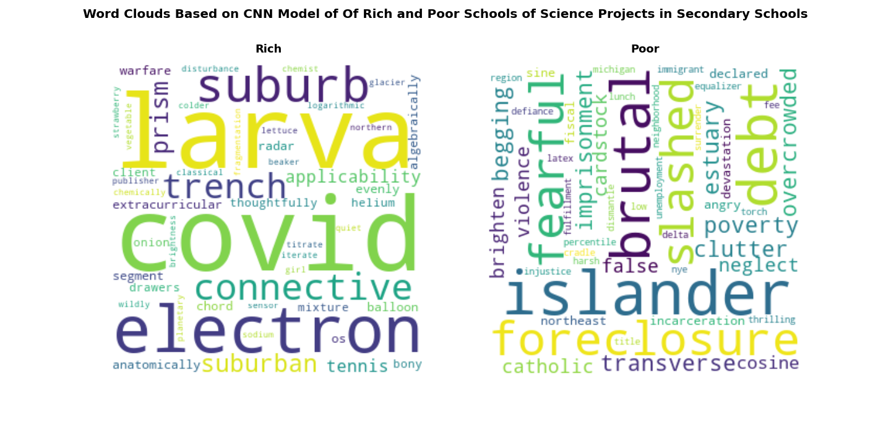

### Other Projects In Secondary Schools (Accuracy 77.94%)
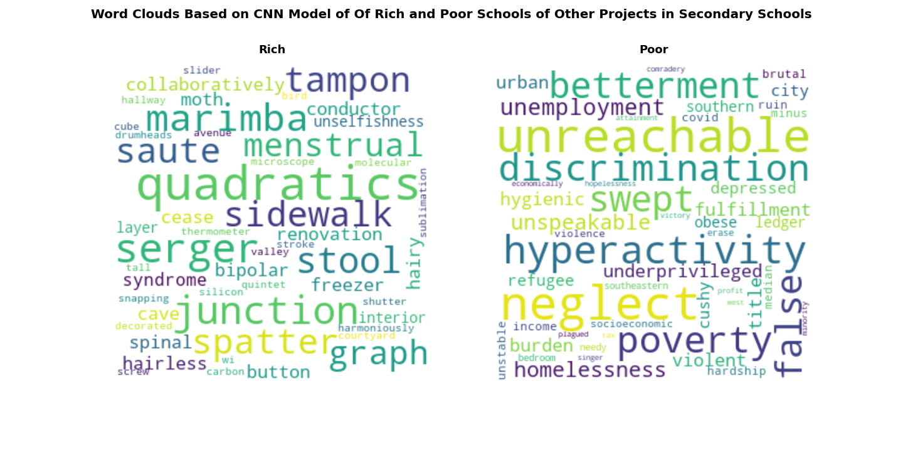

## WordClouds for States with Small Education Gap
### Language Projects in PreK Schools (Accuracy 80.74%)
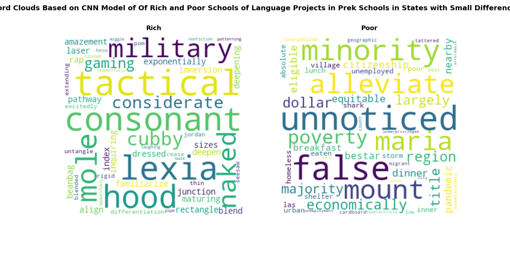

### Science Projects in PreK Schools (Accuracy 80.72%)
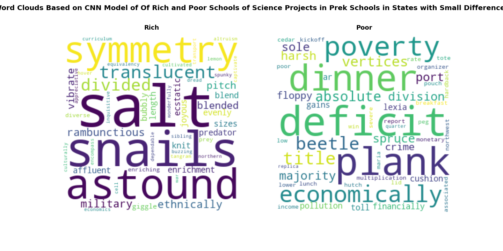

### Other Projects in PreK Schools (Accuracy 79.09%)

### Language Projects In Primary Schools (Accuracy 79.74%)

### Science Projects In Primary Schools (Accuracy 78.36%)

### Other Projects In Primary Schools (Accuracy 79.63%)

## WordClouds for States with Big Education Gap
### Language Projects in PreK Schools (Accuracy 74.72%)
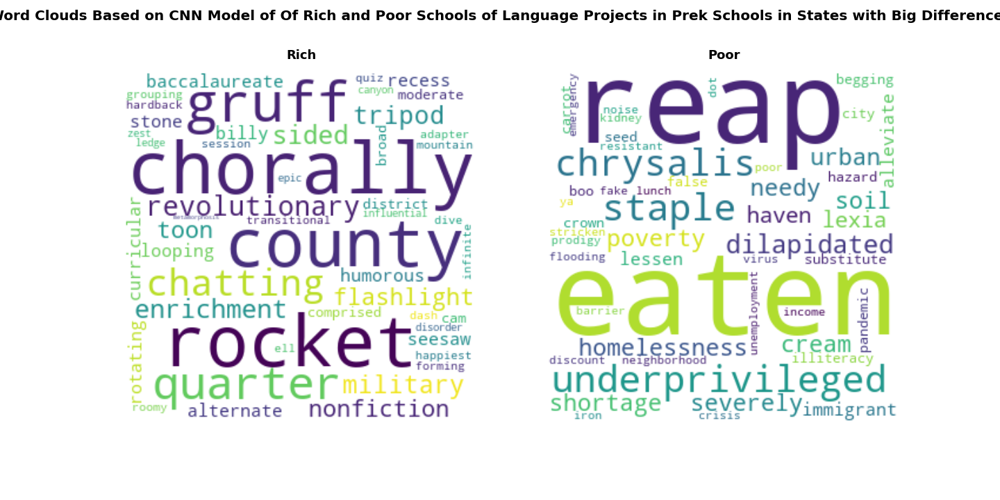

### Science Projects in PreK Schools (Accuracy 77.43%)

### Other Projects in PreK Schools (Accuracy 77.74%)
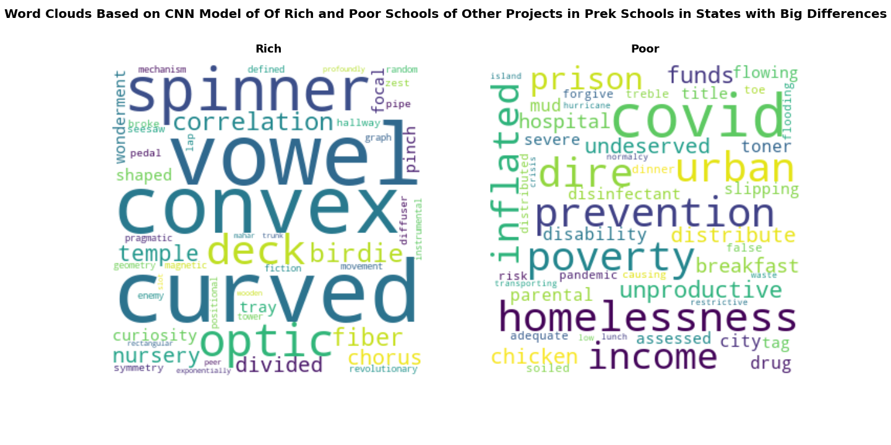

### Language Projects In Primary Schools (Accuracy 78.76%)

### Science Projects In Primary Schools (Accuracy 75.64%)
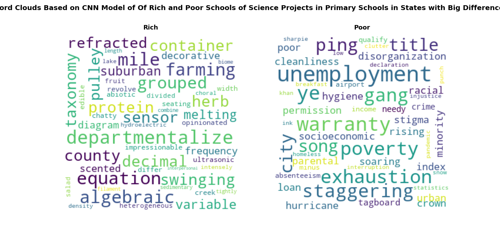

### Other Projects In Primary Schools (Accuracy 77.77%)

